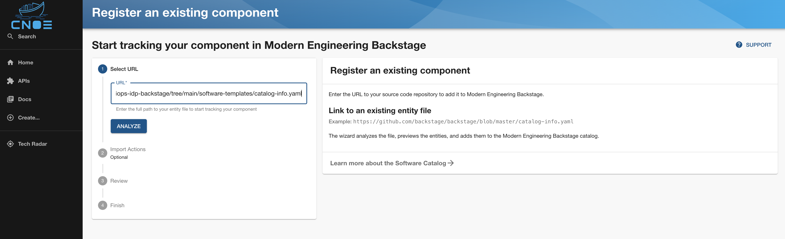
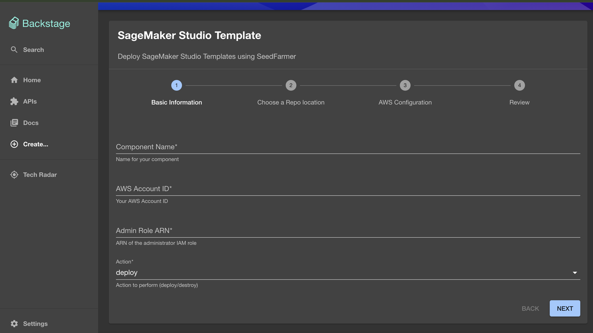

# Deployment Guide

## Prerequisites

- An AWS account with necessary permissions (IAM, EKS, RDS, ALB)
- AWS CLI and Github CLI installed and configured
- Node.js 16.x or later installed
- Docker installed (for local development)
- kubectl installed for EKS cluster management
- Sufficient AWS service quotas for EKS, RDS, and ALB resources

## Backstage Deployment

### Clone and Setup Repository

```bash
git clone https://github.com/aws-samples/appmod-blueprints.git 
cd appmod-blueprints 
```

### Install Dependencies

```bash
npm install
```

### Bootstrap CDK

```bash
npx cdk bootstrap aws://<AWS_ACCOUNT_ID>/<AWS_REGION>
```

### Configure Environment Variables

Create a `.env` file in the root directory:

```env
AWS_ACCOUNT_ID=<your-aws-account-id> 
AWS_REGION=<your-aws-region> 
GITHUB_TOKEN=<your-github-token> 
GITHUB_ORG=<your-github-org>
```

### Deploy Platform

```bash
npx cdk deploy BackstagePlatform --require-approval never
```

### Resources Created

- Backstage frontend and backend services
- Amazon EKS (Elastic Kubernetes Service) cluster and resources for hosting Backstage
- Amazon RDS PostgreSQL instance for the backend database
- Application Load Balancer for handling incoming traffic
- Integration with Github for authentication

### Verify Deployment

Access Backstage using ALB endpoint:


## SageMaker Template Setup

### Clone Repository

```bash
git clone https://github.com/aws-samples/sample-aiops-idp-backstage.git
```

### Setup Prerequisites

Refer to README.md for detailed prerequisites, then:

```bash
cd scripts
```

### Execute Setup Script

```bash
./fork-and-sync.sh
```

This creates a repository with all required SageMaker template files for Backstage integration.

## SageMaker Templates Integration

Our implementation strategy focuses on integrating AIOps modules specifically Amazon SageMaker project templates into an existing Backstage deployment that has been set up using the AWS App Modernization Blueprints and CNOE framework. This integration enables data science teams to self-service their ML infrastructure needs while maintaining organizational standards and security controls.

### Template Registration

1. Click on **Create** and **Register existing component**
2. Add the location of the catalog-info file



3. Review and finish
4. Verify all the AIOPS SageMaker templates are added into your backstage instance


## Using SageMaker Templates

### Step 1: Access Backstage Portal

- Navigate to your Backstage instance URL
- Navigate to the Software Templates
- Click on the **Create** button in the left sidebar
- Browse the available templates and click on **SageMaker Studio Template** card

### Step 2: Fill in Basic Information

- Enter a unique component name (e.g., "ml-team-sagemaker-studio")
- Provide your AWS Account ID where SageMaker will be deployed
- Enter the Admin Role ARN with sufficient permissions
- Select "deploy" as the action



### Step 3: Select Repository Location

- Choose where the template code will be stored
- Select an existing GitHub repository or create a new one
- This repository will store the configuration and workflow files


### Step 4: Configure AWS Settings

- Select the AWS region for deployment (e.g., "us-east-1")
- Enter your AWS Access Key ID, Secret Access Key, and Session Token
- These credentials must have permissions to create SageMaker resources


### Step 5: Review and Create

- Verify all entered information
- Click **Create** to initiate the template generation process


### Step 6: Monitor Deployment Progress

- Backstage will create a new repository with the necessary files
- A GitHub Actions workflow will be automatically triggered
- The workflow will use SeedFarmer to deploy SageMaker Studio


### Step 7: Access Deployment Details

Once complete, Backstage will display links to:
- The created GitHub repository
- The component in the Backstage catalog
- The GitHub Actions workflow logs


### Step 8: Verify Resources

- Navigate to the AWS Console
- Go to the SageMaker service in your selected region
- Find the newly created SageMaker Studio domain and user profile
- Click on **Launch Studio** and begin using the ML environment


### Step 9: Manage Deployment

- To make changes, update the configuration in the GitHub repository
- To destroy the resources, trigger the GitHub Actions workflow with "destroy" action
- Monitor and manage the deployment through the Backstage component page

This streamlined process enables data scientists to quickly provision standardized SageMaker environments while ensuring organizational compliance and reducing the operational burden on platform teams.

## Security Considerations

- Ensure minimal required IAM permissions for deployment and runtime
- Store AWS credentials and GitHub tokens securely
- Configure VPC, subnets, and security groups appropriately
- Implement proper RBAC for Backstage users and GitHub repositories
- Enable CloudTrail and application logs for compliance

## Troubleshooting

### Common Issues

- **CDK Bootstrap failures**: Verify AWS credentials and region configuration
- **EKS cluster access**: Check kubectl configuration and IAM permissions
- **ALB connectivity**: Ensure security groups allow inbound traffic on port 80/443
- **GitHub integration**: Verify GitHub token permissions and organization access
- **SageMaker deployment failures**: Check AWS service quotas and IAM permissions

### Useful Commands

```bash
# Check EKS cluster status
aws eks describe-cluster --name <cluster-name>

# View Backstage logs
kubectl logs -n backstage deployment/backstage

# Monitor GitHub Actions
# Check workflow logs in repository Actions tab
```

## Cleanup and Resource Management

### Destroy Backstage Infrastructure

```bash
npx cdk destroy BackstagePlatform
```

### Remove SageMaker Resources

- Trigger GitHub Actions workflow with "destroy" action
- Manually delete any remaining SageMaker domains/user profiles if needed

### Cost Optimization

- Monitor AWS costs through Cost Explorer
- Consider using Spot instances for non-production EKS nodes
- Set up billing alerts for unexpected cost increases
- Regularly review and cleanup unused resources